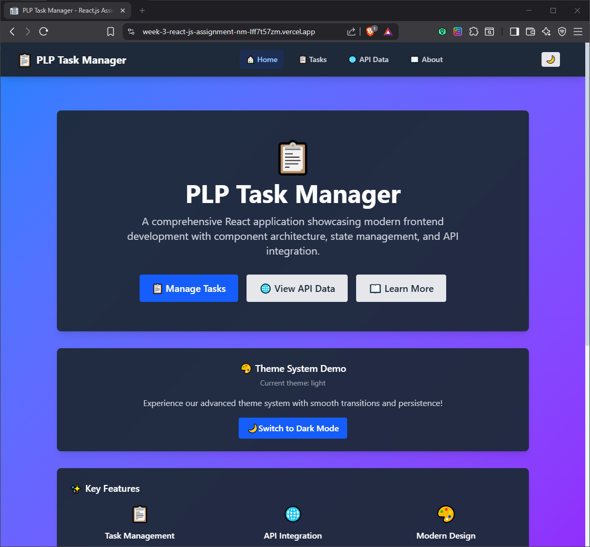
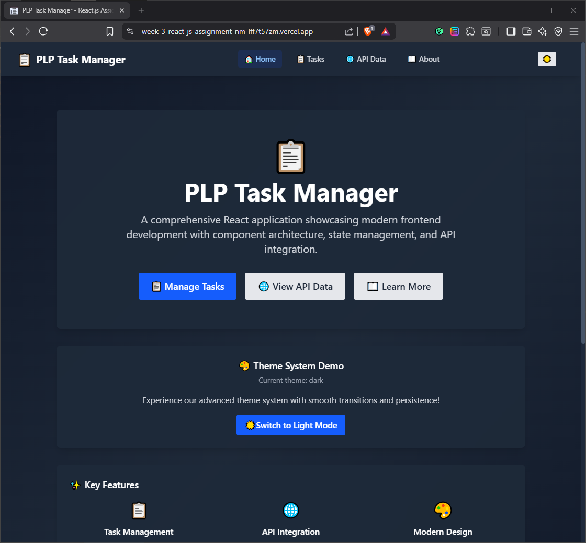
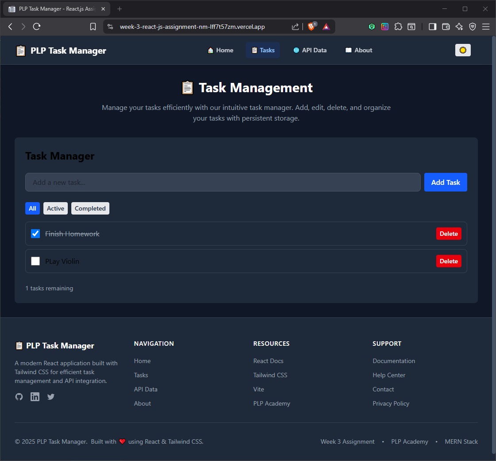
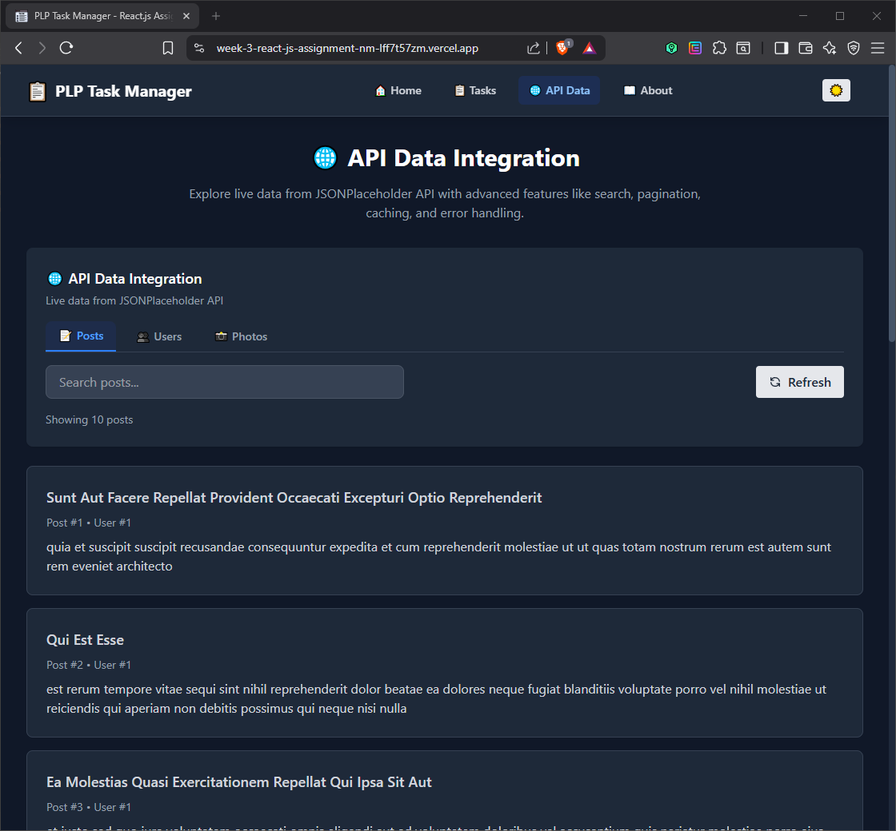
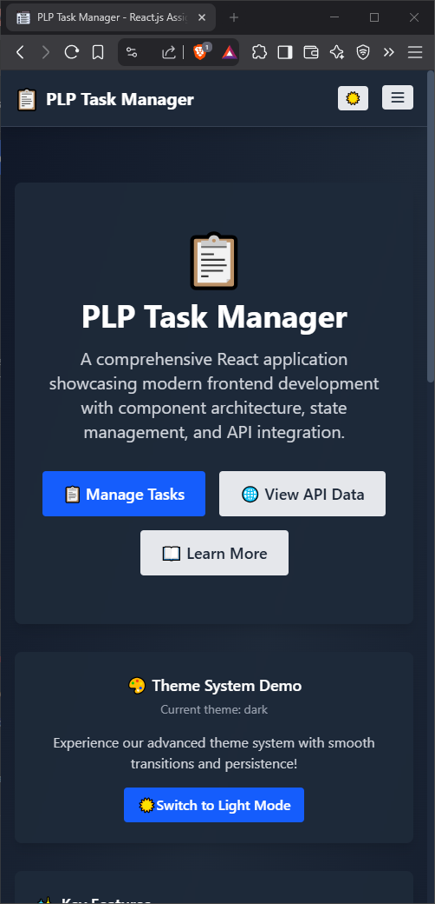

# PLP Task Manager

[](https://week-3-react-js-assignment-nm-lff7t57zm.vercel.app)
[](https://reactjs.org/)
[](https://tailwindcss.com/)
[](https://vitejs.dev/)

A modern, responsive task management application built with React.js and Tailwind CSS. Features include task CRUD operations, external API integration, theme switching, and advanced search capabilities.

**[🚀 Live Demo](https://week-3-react-js-assignment-nm-lff7t57zm.vercel.app)**

## Screenshots

<div align="center">

### Light & Dark Theme



### Task Management & API Integration



### Mobile Responsive Design


</div>

## Features

- **Task Management** Create, read, update, delete tasks with localStorage persistence
- **API Integration** — JSONPlaceholder API with search, pagination, and caching
- **Theme System** — Dark/light mode with system preference detection
- **Responsive Design** — Mobile-first approach, optimized for all devices
- **Advanced Search** — Debounced search with client and server-side filtering
- **Error Handling** — Comprehensive error boundaries and loading states

## Tech Stack

- **React** 19.1.0 — Frontend framework
- **Tailwind CSS** 4.1.11 - Utility-first CSS framework
- **Vite** 7.0.4 - Build tool and development server
- **JavaScript** ES2024 - Modern JavaScript features
- **Vercel** - Deployment platform

## Quick Start

```bash
# Clone repository
git clone https://github.com/PLP-Academy/week-3-react-js-assignment-NMsby.git
cd week-3-react-js-assignment-NMsby

# Install dependencies
npm install

# Start development server
npm run dev
```

Open [http://localhost:5173](http://localhost:5173) to view the application.

## Available Scripts

| Command           | Description              |
|-------------------|--------------------------|
| `npm run dev`     | Start development server |
| `npm run build`   | Build for production     |
| `npm run preview` | Preview production build |
| `npm run lint`    | Run ESLint               |

## Project Structure

```
src/
├── api/                 # API integration layer
├── components/          # Reusable UI components
│   ├── Button.jsx
│   ├── Card.jsx
│   ├── TaskManager.jsx
│   └── ...
├── context/             # React context providers
├── hooks/               # Custom React hooks
├── utils/               # Utility functions
├── App.jsx              # Main application component
└── main.jsx             # Application entry point
```

## API Integration

This application integrates with [JSONPlaceholder](https://jsonplaceholder.typicode.com/) for demonstration purposes:

- **Posts** — Blog-style content with search and pagination
- **Users** — User profiles with contact information
- **Photos** — Image gallery with thumbnail loading

Features include 5-minute caching, debounced search, and comprehensive error handling.

## Deployment

The application is deployed on Vercel with automatic deployments from the main branch.

**Production URL:** https://week-3-react-js-assignment-nm-lff7t57zm.vercel.app

## Development

### Prerequisites
- Node.js 18.0.0+
- npm 8.0.0+

### Local Development
1. Fork and clone the repository
2. Install dependencies: `npm install`
3. Start development server: `npm run dev`
4. Open browser to `http://localhost:5173`

## License

This project was created for educational purposes as part of the PLP Academy MERN Stack Development Program.

---

<div align="center">
PLP Academy Week 3 Assignment
</div>