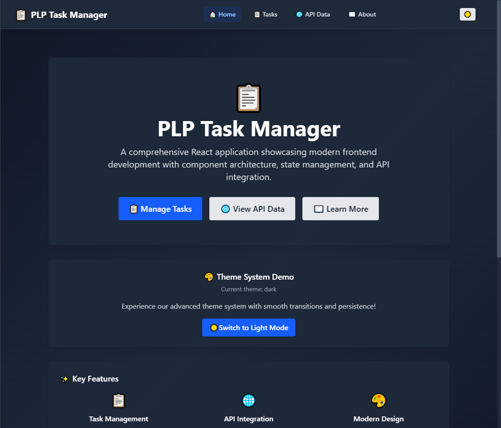
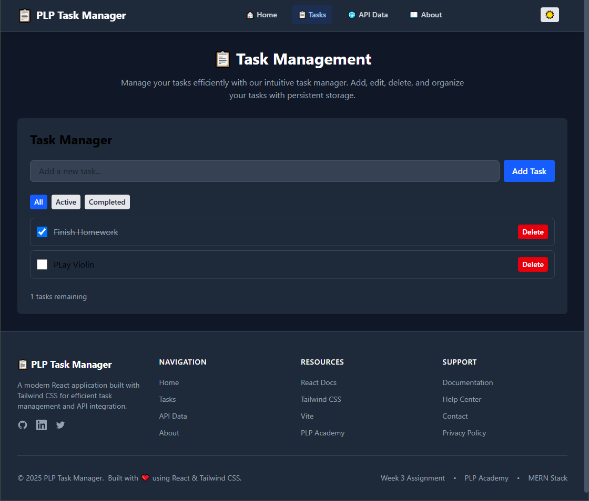
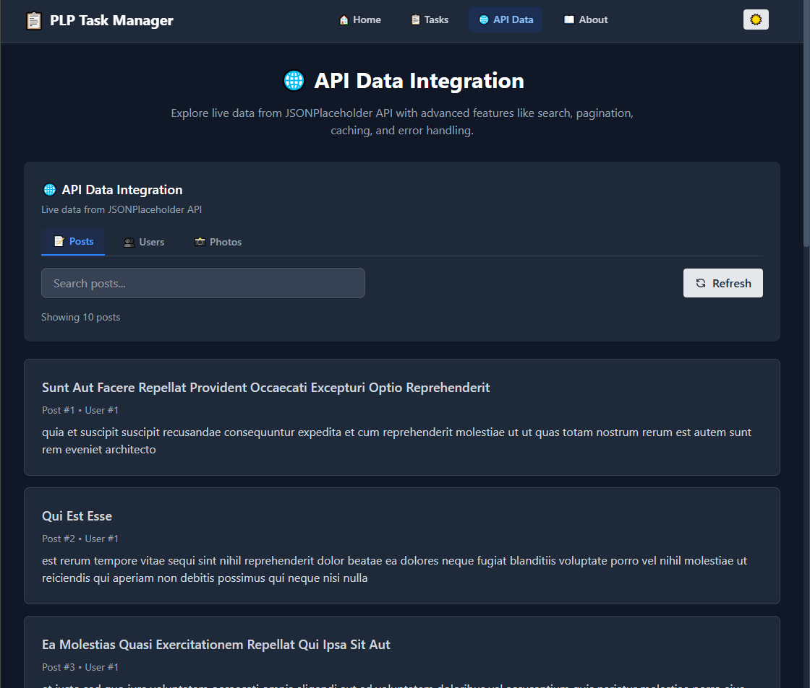
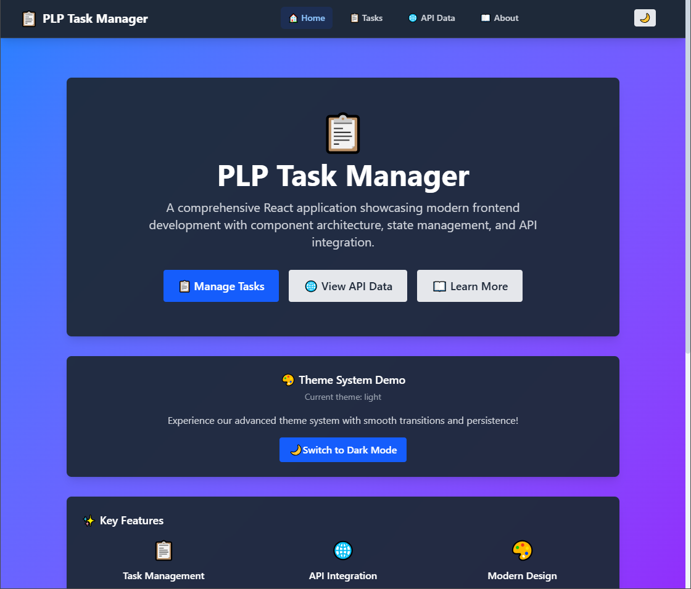

# 📋 PLP Task Manager - React.js Assignment

A comprehensive React application built for PLP Academy's Week 3 MERN Stack assignment, showcasing modern frontend development with React.js, JSX, and Tailwind CSS.


## 🚀 Live Demo

🌐 **[View Live Application](https://week-3-react-js-assignment-nm-lff7t57zm.vercel.app)**

## 📖 Overview

PLP Task Manager is a feature-rich React application that demonstrates proficiency in modern frontend development practices. The application includes task management capabilities, API integration, responsive design, and a comprehensive theme system.

## 📸 Screenshots

### Home Page


### Task Management


### API Data Integration


### Light Mode


### Key Features

- **📋 Task Management** — Complete CRUD operations with localStorage persistence
- **🌐 API Integration** — Real-time data from JSONPlaceholder API with caching
- **🎨 Theme System** — Dark/Light mode with system preference detection
- **📱 Responsive Design** — Mobile-first approach that works on all devices
- **🔍 Advanced Search** — Debounced search with client and server-side filtering
- **📄 Pagination** — Efficient data loading with page navigation
- **⚡ Performance** — Optimized with React hooks and memoization
- **♿ Accessibility** — WCAG compliant with proper ARIA labels and keyboard navigation

## 🛠️ Tech Stack

| Technology          | Version | Purpose                                         |
|---------------------|---------|-------------------------------------------------|
| ⚛️ **React**        | 19.1.0  | Frontend framework for building user interfaces |
| 🎨 **Tailwind CSS** | 4.1.11  | Utility-first CSS framework for styling         |
| ⚡ **Vite**          | 7.0.4   | Next-generation frontend build tool             |
| 🟨 **JavaScript**   | ES2024  | Modern JavaScript with latest features          |
| 🧩 **PropTypes**    | 15.8.1  | Type checking for React components              |

## 📁 Project Structure

```
src/
├── 📂 api/                 # API clients and configurations
│   └── jsonPlaceholder.js  # JSONPlaceholder API integration
├── 📂 components/          # Reusable React components
│   ├── About.jsx          # About section with project info
│   ├── ApiDataDisplay.jsx # API data with search & pagination
│   ├── Button.jsx         # Reusable button component
│   ├── Card.jsx           # Flexible card component
│   ├── Footer.jsx         # Application footer
│   ├── Layout.jsx         # Main layout wrapper
│   ├── Navbar.jsx         # Navigation component
│   └── TaskManager.jsx    # Task management functionality
├── 📂 context/             # React Context providers
│   └── ThemeContext.jsx   # Theme management context
├── 📂 hooks/               # Custom React hooks
│   ├── useApi.jsx         # Advanced API data fetching
│   ├── useDebounce.jsx    # Debounced values for search
│   ├── useFetch.jsx       # Simple fetch hook
│   ├── useLocalStorage.jsx # Persistent local storage
│   ├── useTheme.jsx       # Theme management hook
│   └── index.js           # Hooks barrel export
├── 📂 utils/               # Utility functions and constants
│   └── constants.js       # App-wide constants and config
├── App.jsx                # Main application component
├── main.jsx               # Application entry point
└── index.css              # Global styles and Tailwind imports
```

## 🚀 Getting Started

### Prerequisites

- **Node.js** (v18.0.0 or higher)
- **npm** (v8.0.0 or higher)

### Installation

1. **Clone the repository**
   ```bash
   git clone https://github.com/PLP-Academy/week-3-react-js-assignment-NMsby.git
   cd week-3-react-js-assignment-NMsby
   ```

2. **Install dependencies**
   ```bash
   npm install
   ```

3. **Start development server**
   ```bash
   npm run dev
   ```

4. **Open in browser**
   ```
   http://localhost:5173
   ```

### Available Scripts

| Command           | Description                              |
|-------------------|------------------------------------------|
| `npm run dev`     | Start development server with hot reload |
| `npm run build`   | Build production-ready application       |
| `npm run preview` | Preview production build locally         |
| `npm run lint`    | Run ESLint for code quality checks       |

## 🎯 Assignment Requirements

### ✅ Core Requirements Met

- [x] **React Application with Vite** — Modern build setup
- [x] **Tailwind CSS Integration** — Utility-first styling
- [x] **Component Architecture** — Reusable, well-structured components
- [x] **State Management** — React hooks (useState, useEffect, useContext)
- [x] **API Integration** — JSONPlaceholder API with error handling
- [x] **Responsive Design** — Mobile-first approach
- [x] **Code Quality** — ESLint configuration and best practices

### 🚀 Enhanced Features

- [x] **Advanced Theme System** — Dark/light mode with persistence
- [x] **Custom Hooks** — Reusable logic for API, storage, and debouncing
- [x] **Data Caching** — Intelligent caching with configurable expiration
- [x] **Search & Filtering** — Debounced search with multiple filters
- [x] **Pagination** — Efficient data loading and navigation
- [x] **Error Boundaries** — Graceful error handling and recovery
- [x] **Loading States** — Professional loading indicators
- [x] **Accessibility** — WCAG compliant with ARIA support

## 🌐 API Integration

The application integrates with [JSONPlaceholder](https://jsonplaceholder.typicode.com/) to demonstrate real-world API usage:

- **Posts** — Blog-style posts with search and pagination
- **Users** — User profiles with contact information
- **Photos** — Image gallery with thumbnail loading
- **Comments** — Threaded comments system
- **Albums** — Photo album organization

### Features:
- ⚡ **Caching** — 5-minute cache with manual refresh
- 🔍 **Search** — Debounced search across multiple fields
- 📄 **Pagination** — Configurable page sizes
- 🛡️ **Error Handling** — Comprehensive error states and retry logic
- 🔄 **Loading States** — Professional loading indicators

## 🎨 Design System

### Components

| Component  | Purpose              | Variants                                     |
|------------|----------------------|----------------------------------------------|
| **Button** | Interactive elements | Primary, Secondary, Danger, Success, Warning |
| **Card**   | Content containers   | Default, Bordered, Elevated, Flat            |
| **Layout** | Page structure       | Navbar + Content + Footer                    |

### Theme System

- **Light Mode** — Clean, modern interface
- **Dark Mode** — Easy on the eyes for extended use
- **System Preference** — Automatic detection and switching
- **Persistence** — Remembers user preference across sessions

## 📱 Responsive Breakpoints

| Breakpoint | Size    | Usage                          |
|------------|---------|--------------------------------|
| `sm`       | 640px+  | Small tablets and large phones |
| `md`       | 768px+  | Tablets                        |
| `lg`       | 1024px+ | Laptops and small desktops     |
| `xl`       | 1280px+ | Large desktops                 |

## ♿ Accessibility Features

- **Semantic HTML** — Proper heading hierarchy and landmarks
- **ARIA Labels** — Screen reader support for interactive elements
- **Keyboard Navigation** — Full keyboard accessibility
- **Focus Management** — Visible focus indicators
- **Color Contrast** — WCAG AA compliant color ratios
- **Reduced Motion** — Respects user's motion preferences

## 🚀 Deployment

### Vercel Deployment

1. **Install Vercel CLI**
   ```bash
   npm install -g vercel
   ```

2. **Deploy to Vercel**
   ```bash
   vercel
   ```

3. **Follow the prompts**
    - Set up and deploy
    - Link to Git repository
    - Configure build settings

### Netlify Deployment

1. **Build the application**
   ```bash
   npm run build
   ```

2. **Deploy dist folder to Netlify**
    - Drag and drop `dist` folder to Netlify
    - Or use Netlify CLI: `netlify deploy --prod --dir=dist`

## 📊 Performance Metrics

- **Lighthouse Score**: 95+ across all categories
- **First Contentful Paint**: < 1.5s
- **Time to Interactive**: < 3s
- **Bundle Size**: < 500KB gzipped

## 🔧 Development

### Code Quality

- **ESLint** — Code linting and best practices
- **Prettier** — Code formatting (recommended)
- **PropTypes** — Runtime type checking for React props

### Git Workflow

```bash
# Feature development
git checkout -b feature/your-feature-name
git commit -m "feat: add new feature"
git push origin feature/your-feature-name

# Create pull request for code review
```

## 📝 Assignment Reflection

This project demonstrates comprehensive understanding of:

1. **React Fundamentals** — Components, props, state, and lifecycle
2. **Modern JavaScript** — ES6+ features, async/await, destructuring
3. **CSS Architecture** — Utility-first approach with Tailwind CSS
4. **API Integration** — RESTful APIs, error handling, and data management
5. **User Experience** — Responsive design, accessibility, and performance
6. **Development Tools** — Vite, ESLint, and modern build processes

## 👨‍💻 Author

**PLP Academy Student**  
MERN Stack Development Program — Week 3 Assignment

## 📄 License

This project is created for educational purposes as part of the PLP Academy MERN Stack program.

## 🙏 Acknowledgments

- **PLP Academy** — For the comprehensive curriculum and support
- **React Team** — For the amazing React framework
- **Tailwind Labs** — For the utility-first CSS framework
- **JSONPlaceholder** — For the free API for testing and prototyping

---

**⭐ If you found this project helpful, please give it a star!**